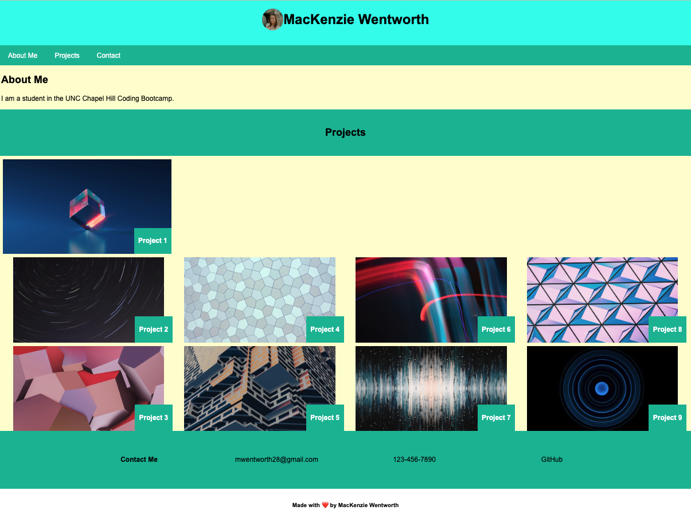

# Professional Porfolio of MacKenzie Wentworth

## Deployed Webpage

Link to deployed web application: 

## The Task

Assigned by this week's Challenge, I was tasked to build my own portfolio webpage from scratch to present to future employers. The portfolio incorporates advanced CSS skills to include the following items:

* Developer's name and a recent photo or avatar
* Navigation bar with links for sections throughout the portfolio
* Sections to include details about the developer, their work/projects, and contact information
* Links attached to each project that directs the user to the deployed application
* Responsive design accessibility to view the portfolio using different screen sizes and devices based on the user's viewport

## Mock-Up

The following image shows the web application's appearance and functionality for MacKenzie Wentworth's porfolio:

## Credits

### Images:
* project-1.jpg: https://www.pexels.com/photo/purple-and-pink-diamond-on-blue-background-5011647/
* project-2.jpg: https://www.pexels.com/photo/time-lapse-photo-of-stars-on-night-924824/
* project-3.jpg: https://www.pexels.com/photo/abstract-art-background-12732215/
* project-4.jpg: https://www.pexels.com/photo/abstract-background-of-wall-with-geometric-ornament-3695238/
* project-5.jpg: https://www.pexels.com/photo/abstract-art-background-12810661/
* project-6.jpg: https://www.pexels.com/photo/modern-art-1910225/
* project-7.jpg: https://www.pexels.com/photo/abstract-art-painting-12492191/
* project-8.jpg: https://www.pexels.com/photo/purple-and-blue-abstract-wallpaper-430207/
* project-9.jpg: https://www.pexels.com/photo/low-angle-view-of-spiral-staircase-against-black-background-247676/

## License

Please refer to the LICENSE in the repo.